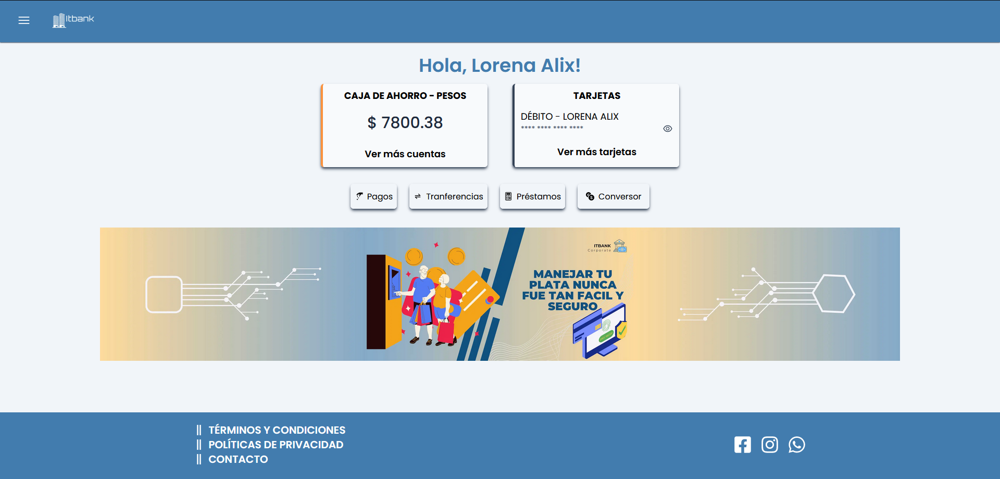
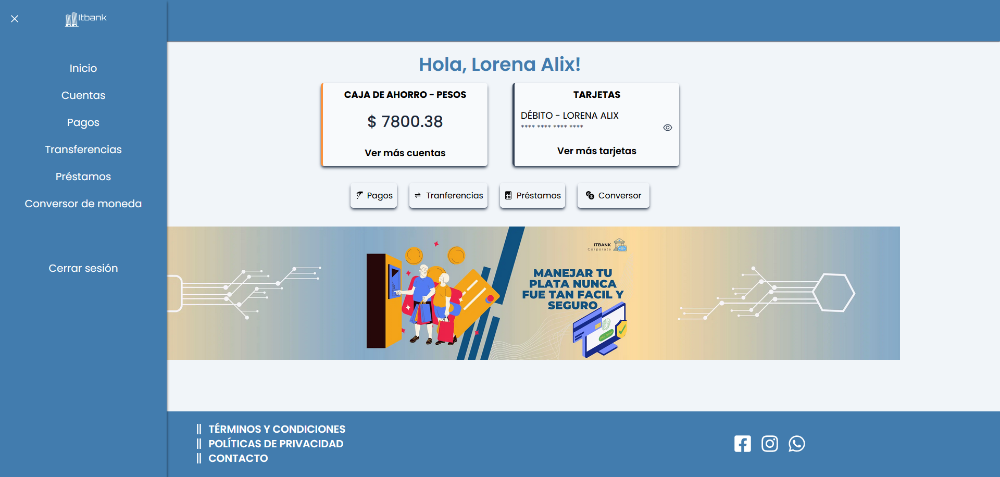
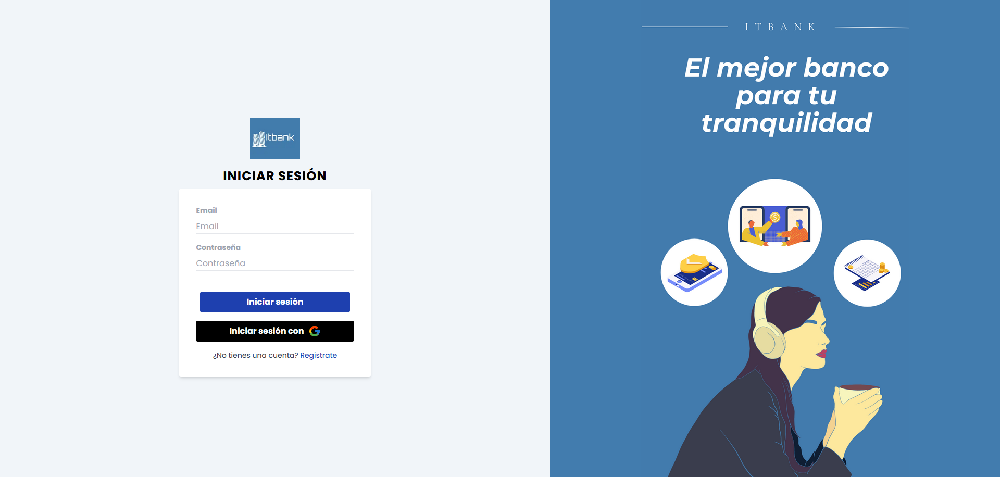
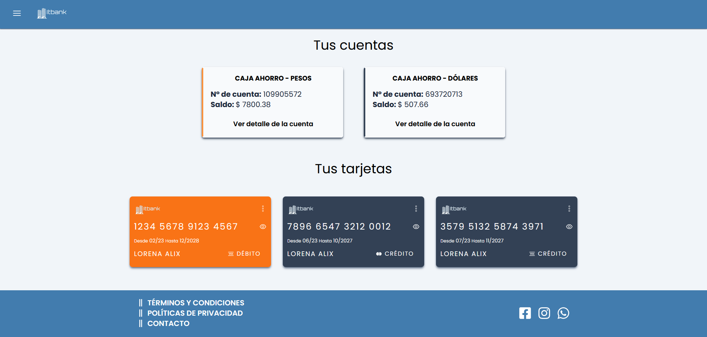
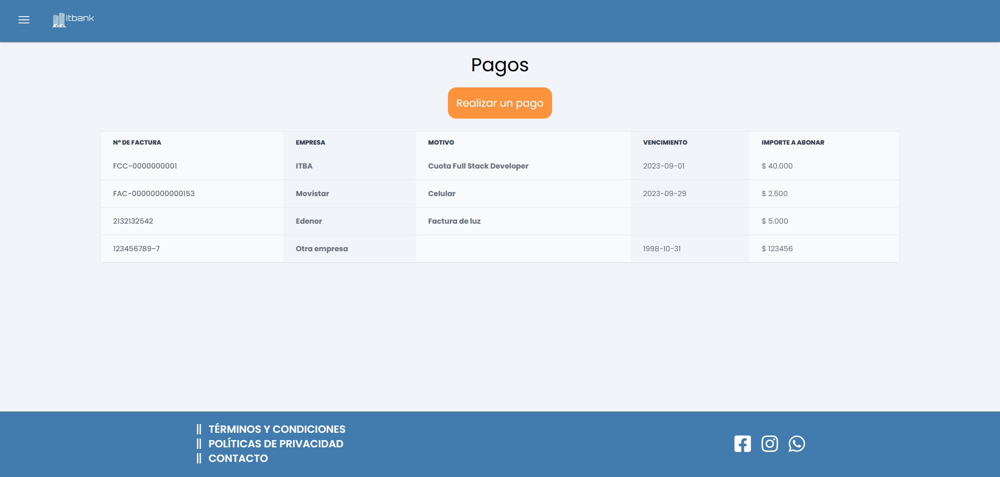
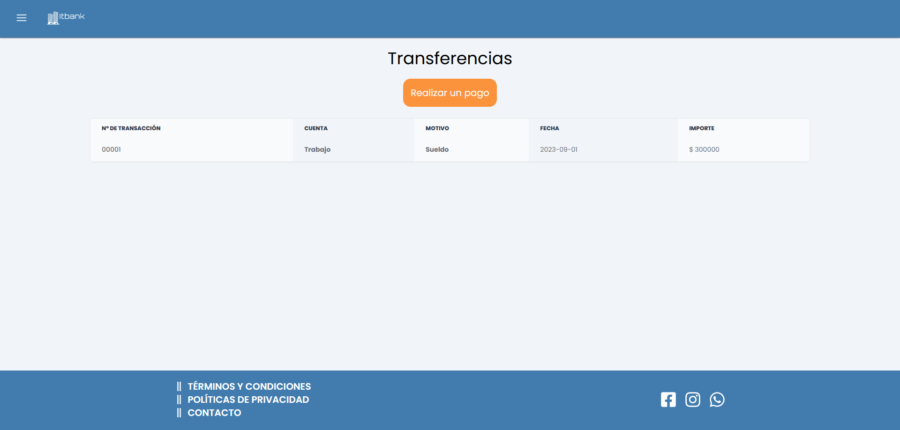
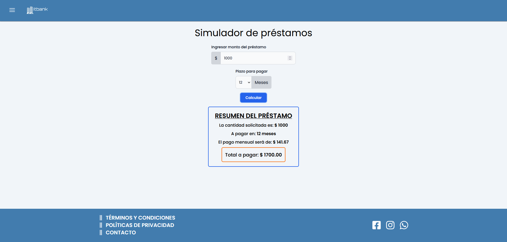

# IT Bank - Sprint N°3
---

## Preview
    

## Descripción del proyecto

Una vez realizado el Homebanking en React, pasamos el codigo a Next para obtener un mejor rendimiento de la pagina.

## Requisitos para ejecutar el proyecto

  Para poder ejecutar el proyecto es necesario lo siguiente:

  1. Tener instalado Node.js y npm/yarn.

  2. Clonar el repositorio desde Github.
  
  3. Ejecutar el comando ***npm install*** / ***yarn install*** para las dependencias.

  4. Ejecutar el comando ***npm run dev*** / ***yarn dev*** para correr el proyecto de forma local.

  5. Abrir en el navegador la ruta ***http://localhost:3000*** para visualizarlo.

## Características

Algunas de las características del proyecto:

### - Inicio de sesión y registro:
    
   

### - Cuentas:
      

###  - Pago de facturas:
   
   
###  - Transferencias:
   

###   - Conversor de moneda:
   

###  - Calculadora de préstamos:
    


## Tecnologías con las que se desarrolló el proyecto  

*  JavaScript
*  ReactJs
*  NextJs 13

## Código para destacar (Funcionalidad del conversor de monedas)

```
"use client";
import { useEffect, useState } from "react";
import { HiChevronRight } from "react-icons/hi";

export default function FormConversor() {
  const [moneda1, setMoneda1] = useState("USD");
  const [moneda2, setMoneda2] = useState("ARS");
  const [listaMonedas, setListaMonedas] = useState([]);
  const [montoIngresado, setMontoIngresado] = useState("");
  const [valorCambio, setValorCambio] = useState(undefined);
  const [valorMoneda1, setValorMoneda1] = useState(undefined);
  const [valorMoneda2, setValorMoneda2] = useState(undefined);
  const [resultado, setResultado] = useState(false);

  useEffect(() => {
    const URL = "https://v6.exchangerate-api.com/v6";
    const API_KEY = "b5161e898c850d8b3be17bf6";

    fetch(`${URL}/${API_KEY}/latest/${moneda1}`)
      .then((resp) => resp.json())
      .then((data) => setListaMonedas(Object.keys(data.conversion_rates)));
  }, [moneda1]);

  function handleConvert(e) {
    e.preventDefault();
    if (moneda1 !== moneda2 && montoIngresado !== 0) {
      const URL = "https://v6.exchangerate-api.com/v6";
      const API_KEY = "b5161e898c850d8b3be17bf6";
      fetch(`${URL}/${API_KEY}/pair/${moneda1}/${moneda2}/${montoIngresado}`)
        .then((resp) => resp.json())
        .then((data) => {
          setValorCambio(data.conversion_rate);
          setValorMoneda1(data.base_code);
          setValorMoneda2(data.target_code);
          setResultado(true);
        });
    }
  }

  return (
    <>
      <form>
        <div className="flex justify-center items-center gap-4 my-2">
          <select
            value={moneda1}
            name="moneda1"
            id="moneda1"
            onChange={(e) => setMoneda1(e.target.value)}
            className="bg-gray-50 border rounded-md border-gray-300 text-gray-900  focus:ring-blue-500 focus:border-blue-500 block w-full p-3"
            required
          >
            {listaMonedas.map((monedas, i) => (
              <option value={monedas} key={i}>
                {monedas}
              </option>
            ))}
          </select>
          <div>
            <span className="text-xl">
              <HiChevronRight />
            </span>
          </div>
          <select
            value={moneda2}
            name="moneda2"
            id="moneda2"
            onChange={(e) => setMoneda2(e.target.value)}
            className="bg-gray-50 border rounded-md border-gray-300 text-gray-900  focus:ring-blue-500 focus:border-blue-500 block w-full p-3"
            required
          >
            {listaMonedas.map((monedas, i) => (
              <option value={monedas} key={i}>
                {monedas}
              </option>
            ))}
          </select>
        </div>
        <div className="flex flex-col justify-center items-center gap-3">
          <input
            defaultValue={montoIngresado}
            onChange={(e) => setMontoIngresado(e.target.value)}
            className="bg-gray-50 border border-gray-300 text-gray-900 text-sm rounded-md focus:ring-blue-500 focus:border-blue-500 block w-full p-3"
            type="number"
            placeholder="Ingresar monto"
            required
            min="1"
            name="montoInput"
          />
          <button
            className="text-white bg-blue-600 hover:bg-blue-700 focus:ring-2 focus:outline-none  font-semibold rounded-md text-sm w-auto px-5 py-2 "
            onClick={handleConvert}
            name="convertirBoton"
          >
            Convertir
          </button>
        </div>
      </form>
      {resultado === true ? (
        <div className="flex font-semibold m-2 sm:flex-col sm:items-center">
          <span className=" text-red-600 mx-1">
            {montoIngresado} {valorMoneda1}
          </span>
          <div className="flex gap-1 sm:flex-col">
            <p>es equivalente a:</p>
            <span className="text-green-600 text-center">
              {(valorCambio * montoIngresado).toFixed(2)} {valorMoneda2}
            </span>
          </div>
        </div>
      ) : (
        <p className="font-semibold text-md my-2 text-center">
          Ingrese un valor para realizar la conversión
        </p>
      )}
    </>
  );
}

```
## Observaciones del proyecto

> Los campos y datos en las secciones de "Pagos" y "Transferencias" no se almacenan, al recargar la pagina se reinician.

> Se utiliza el inicio de sesión como pagina principal para ejecutar el proyecto.


## Recursos utilizados

* API ExchangeRate (Obtener el valor de las monedas para el conversor)
* TailwindCSS (Estilos de css)
* Google Font (Fonts del sitio)
* MockApi (Generación de usuarios)

## Integrantes (Grupo 1)

* [Ana Jazmin Vazquez](https://github.com/AJVazquez27)
* [Natalia Anahí Vizcarra Savino](https://github.com/NeitRoot)
* [Juan Cruz Musi](https://github.com/JuanMusi)
* [Jorge Caballero](https://github.com/jorgecaballer0)